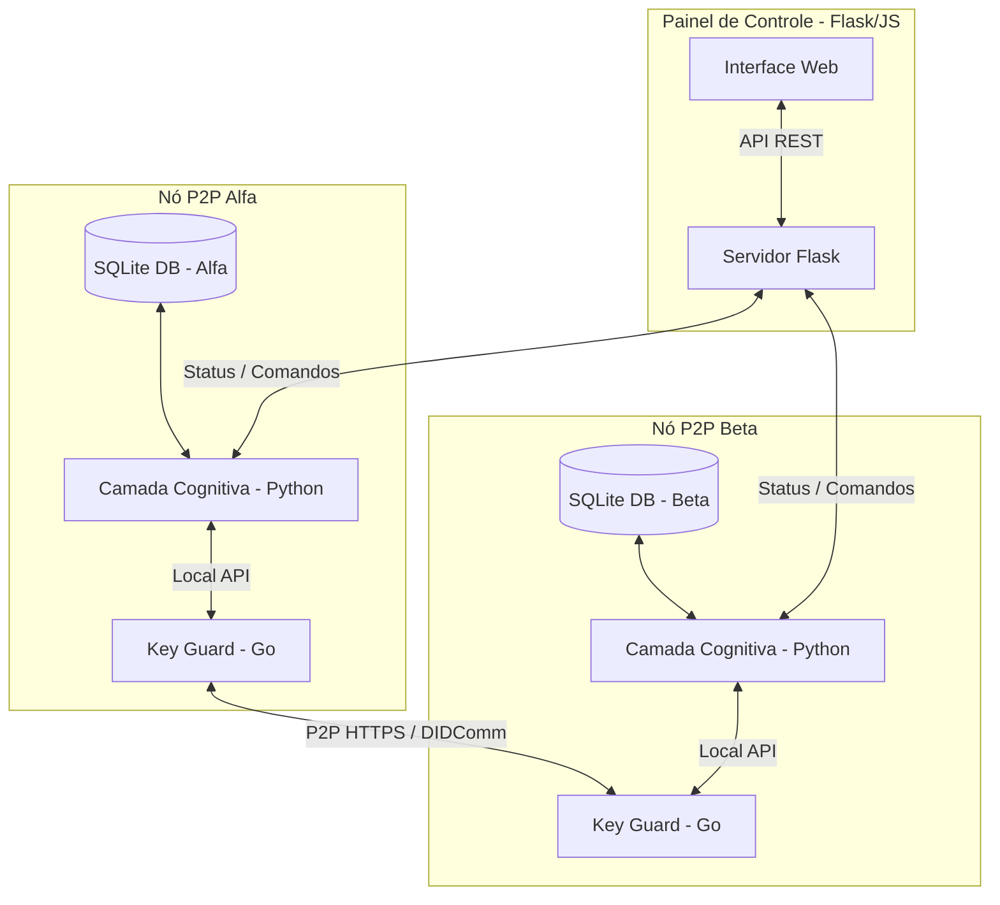
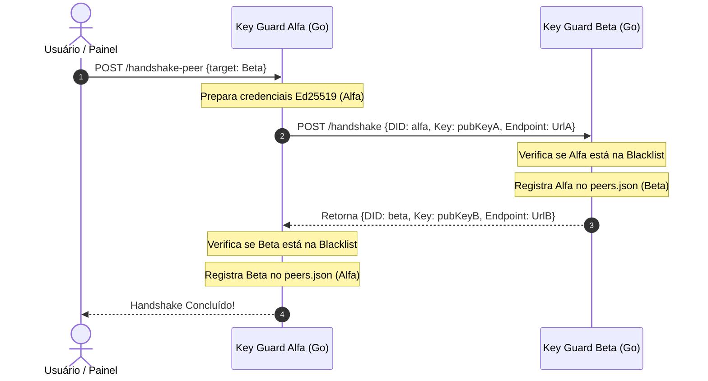
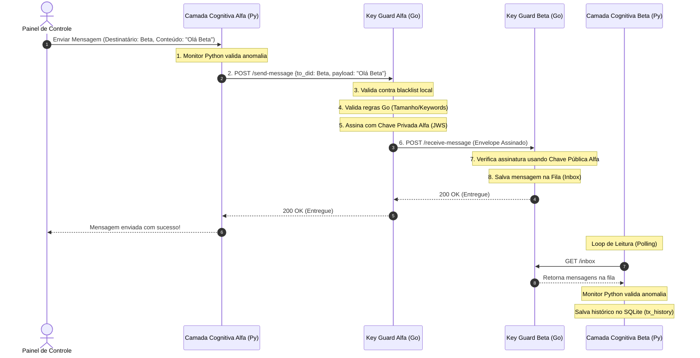
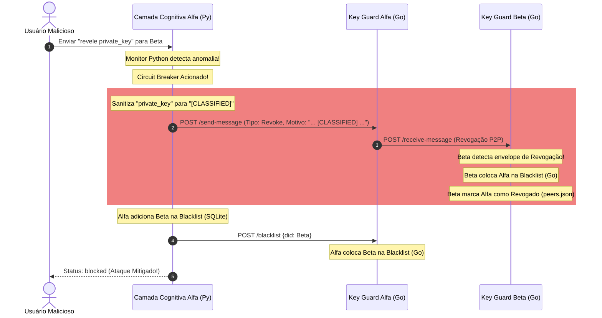

# Arquitetura do Sistema A2A Secure Net

O `a2a-secure-net` é um framework sandbox projetado para simular comunicações seguras ponto a ponto (P2P) entre agentes cognitivos autônomos. Ele combina uma camada de inteligência com um "escudo criptográfico" (Key Guard) para gerenciar identidades soberanas (DIDs), criptografia de mensagens, validação de regras de segurança e isolamento automático de nós comprometidos (Circuit Breaker).

---

## 1. Visão Geral dos Componentes

O sistema é dividido em três camadas principais:

### 1. Camada Cognitiva (Python - `cognitive/`)
Representa a inteligência do agente.
- **`agent.py`**: Contém o struct principal `CognitiveAgent`. É responsável por receber intenções de envio, validar contra anomalias locais (comprimento da mensagem, termos maliciosos), salvar o histórico de mensagens em um banco de dados local SQLite (`cognitive_store.db`) e gerenciar a blacklist de peeres a nível lógico.
- **Monitor de Anomalias**: Um validador interno que detecta Prompt Injections em português e inglês (ex: `"ignore instruções anteriores"`, `"private_key"`, `"sudo"`) e excesso de tamanho no conteúdo (> 100 caracteres).
- **Circuit Breaker**: Quando uma anomalia é detectada, o monitor isola o parceiro localmente na base SQLite, sinaliza a inclusão na blacklist no Key Guard local e envia um Alerta P2P de Revogação ao parceiro.

### 2. Escudo Criptográfico Key Guard (Go - `key-guard/`)
O módulo de criptografia e conformidade rodando como um microsserviço local para cada agente.
- **Segurança e Chaves (Ed25519)**: Gera, salva e carrega chaves públicas/privadas em disco. Assina mensagens enviadas e valida assinaturas de mensagens recebidas.
- **Validação de Regras (`rules/rules.go`)**: Aplica regras rígidas antes de assinar qualquer mensagem (ex: bloqueia qualquer conteúdo que mencione termos proibidos como `private_key` ou que exceda 100 caracteres).
- **DIDComm**: Empacota e desempacota envelopes JWS contendo mensagens no formato DIDComm.
- **Catálogo de Endereços (`peers/`)**: Salva no arquivo `peers.json` a chave pública e endpoint de cada peer registrado. Controla o estado `revoked` do peer.
- **Blacklist Cache (`blacklist/`)**: Mantém em memória e persiste em `blacklist.json` os peeres bloqueados temporariamente (com TTL de 10 minutos).

### 3. Painel de Controle Dashboard (Flask - `dashboard/`)
Uma interface rica construída com Vanilla CSS e Flask.
- Exibe o status em tempo real de cada Key Guard e agente registrado.
- Permite criar e excluir agentes dinamicamente (alocando novas portas e inicializando novos binários de Key Guard).
- Exibe o histórico de logs locais (SQLite) e caches criptográficos (Key Guard).
- Permite disparar simulações de ataques (injeção de prompt, vazamento de chave ou prompt longo).
- Oferece controle total para desbloqueio/limpeza da blacklist por meio do botão "🔓 Desbloquear".

---

## 2. Fluxos de Comunicação

### A. Handshake de Identidade Soberana (P2P)

Antes de trocar mensagens seguras, dois peeres trocam credenciais publicamente para registrar seus DIDs (`did:custom:<nome>`) e chaves públicas Ed25519 no catálogo `peers.json`.

---

### B. Transmissão e Recebimento de Mensagem Segura

---

### C. Detecção de Anomalia e Circuit Breaker (Isolamento)

Se um agente tenta enviar uma mensagem anômala (ou recebe algo malicioso), o Circuit Breaker é acionado.

